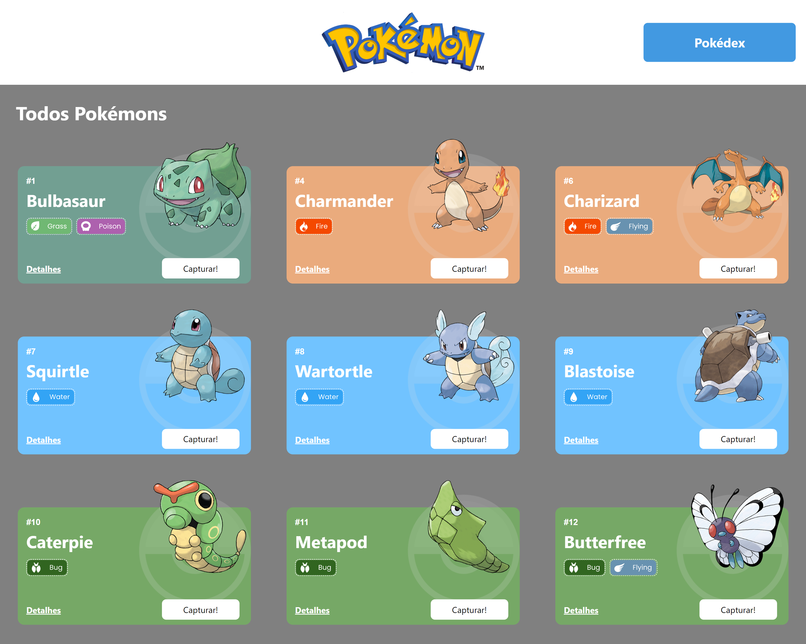

# Projeto Pokedéx



O Projeto React e APIs é um site de pokémons que possui três páginas: Home, Pokedex e Detalhes. 

Este projeto terá como fonte de dados para a sua criação a Poke Api, uma Api pública, muito usada para aplicações focadas em aprendizado de programação e também usada em cases de processos seletivos.

## Índice

- <a href="#funcionalidades-do-projeto">Funcionalidades do Projeto</a>
- <a href="#demonstração">Demonstração</a>
- <a href="#como-rodar-este-projeto">Como rodar este projeto?</a>
- <a href="#tecnologias-utilizadas">Tecnologias utilizadas</a>
- <a href="#autores">Autores</a>

## 💻 Funcionalidades do Projeto

- [x] Mostra uma lista de Pokemons, contendo 50 pokemons.
- [x] Cada Pokemon é representado por um card personalizado, conforme seu tipo.
- [x] Botão de capturar o pokémon para adicioná-lo à Pokedex
- [x] Botão de excluir o pokémon da Pokedex
- [x] Botão para acessar os detalhes do pokémon
- [x] Botão de excluir o pokémon da Pokédex através da página de Detalhes (se o pokémon selecionado estiver sido capturado)
- [x] Botão nas páginas Pokédex e Detalhes que volta para a página Inicial (Home)

## 📺 Demonstração
[Link demonstração](https://pokedex-api-giodev.surge.sh/)

## 💿 Como rodar este projeto?

```bash
# Clone este repositório
$ git clone linkrepo

# Acesse a pasta do projeto no seu terminal
$ cd projeto-pokedex

# Instale as depedências
$ npm install

# Execute a aplicação
$ npm run start

# A aplicação será iniciada na porta 3000, acesse pelo navegador: http://localhost:3000

```

## 🚀 Tecnologias Utilizadas

1.[React](https://pt-br.reactjs.org/)

2.[React Router](https://reactrouter.com/)

3.[React Context](https://reactjs.org/docs/context.html)

4.[Axios](https://axios-http.com/ptbr/docs/intro)

5.[Styled Components](https://styled-components.com/)

6.[Chakra Ui](https://chakra-ui.com/)

## 👩‍💻 Autores

[Linkedin](https://www.linkedin.com/ingiovana-ferreira-tiburtino-475486216/)
